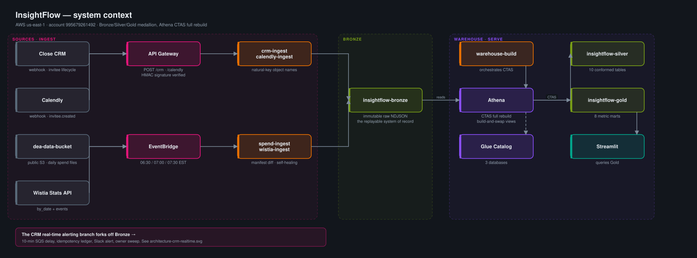
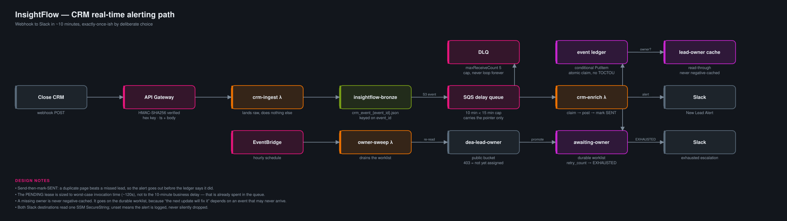
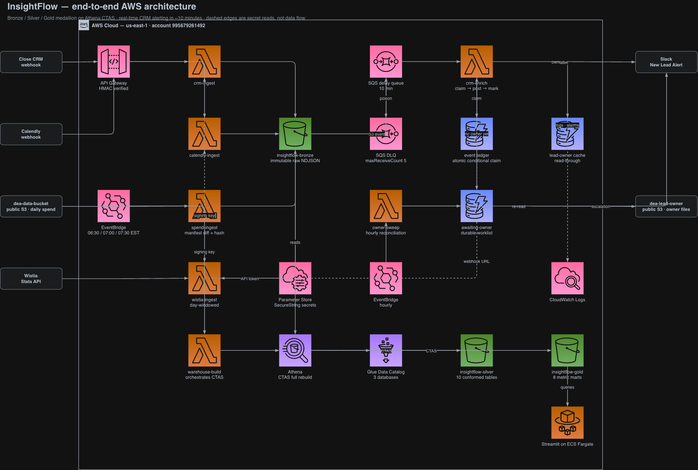

# InsightFlow

[](https://github.com/Shiva050/insightflow-realtime-attribution/actions/workflows/tests.yml)

Real-time attribution across CRM, meeting-scheduling and video-engagement data.
Close, Calendly and Wistia land in a medallion lakehouse on AWS, feeding both a
sales alerting path and a cross-source marketing funnel.

**Status: deployed and running** in `us-east-1`. Two of four feeds carry real
data; the CRM and Calendly webhook subscriptions are created by the SMEs and are
still pending — see [Deployment status](#deployment-status).

---

## Architecture

Three views rather than one crowded canvas. The batch medallion and the
real-time alerting branch answer different questions for different audiences,
and forcing them onto a single diagram is what made an earlier version hard to
read. Each view below is deliberately scoped.

| View | Answers | Format |
|---|---|---|
| [1. System context](#1-system-context) | How does data get from four sources to a dashboard? | SVG |
| [2. CRM real-time path](#2-crm-real-time-path) | How does a new lead become a Slack alert in 10 minutes? | SVG |
| [3. Full AWS architecture](#3-full-aws-architecture) | Which AWS services, and how are they wired? | draw.io + PNG |

### 1. System context

Four sources, two ingest styles, one Bronze landing zone, then the medallion
build and the dashboard. This is the view for "what is this system".



### 2. CRM real-time path

The branch where the interesting failure modes live: the 10-minute delay that
lets Close assign an owner, the atomic idempotency claim, the send-then-record
ordering, and the reconciliation sweep that drains the awaiting-owner worklist.
Slack appears twice — the new-lead alert and the exhausted-lead escalation both
post to the same webhook.



### 3. Full AWS architecture

Every service end to end with AWS iconography — the view for an infrastructure
review.



Two conventions worth knowing before reading it:

- **The AWS Cloud boundary means what it says.** The vendor webhooks, the two
  third-party S3 buckets (`dea-data-bucket`, `dea-lead-owner`) and Slack are
  drawn *outside* it, because they are not ours.
- **Dashed edges are secret reads, not data flow.** Parameter Store hands each
  Lambda a SecureString at cold start; nothing about the pipeline's data moves
  along those lines.

Editable source: [`assets/insightflow-architecture-aws.drawio`](assets/insightflow-architecture-aws.drawio).
Open it at [app.diagrams.net](https://app.diagrams.net) via **File → Open From →
Device**, then re-export with **File → Export as → PNG**.

<!-- All three diagrams are generated, never hand-placed:
       python3 tools/render_architecture.py   -> the two README SVGs
       python3 tools/render_drawio.py         -> the draw.io source
     The layout is data. The SVG generator asserts that no two node footprints
     overlap and that no vertical connector clips a caption; the draw.io
     generator asserts one node per grid cell and rejects dangling edges. A
     collision fails the build instead of surviving into the exported image.
     Edit the node grid in those scripts, not the output. The PNG is a manual
     draw.io export and is the one artefact here that is NOT reproducible from
     source — re-export it after any change to the .drawio. -->

<details>
<summary>Text version of the same flow</summary>

```
                     ┌─ Close CRM ──────────┐  webhook
                     ├─ Calendly bookings ──┤  webhook
   sources           ├─ Calendly spend ─────┤  scheduled pull
                     └─ Wistia ─────────────┘  scheduled API pull
                                │
   BRONZE      S3, raw NDJSON, natural-key filenames, immutable
                                │
   TRANSFORM   EventBridge → Lambda → Athena CTAS (full rebuild, build-and-swap)
                                │
   SILVER      S3 Parquet · 10 conformed tables · Glue Data Catalog
                                │
   GOLD        S3 Parquet · 8 metric marts
                                │
   SERVE       Streamlit → Athena
```

</details>

No dbt, no Snowflake, AWS only — all spec constraints.

**Silver and Gold are deliberately not partitioned.** Athena CTAS caps at 100
partitions per query and this is a full rebuild, so date partitioning would work
until history passed roughly three months and then fail abruptly. At these
volumes it buys nothing.

### Feeds

| Source | Arrival | Bronze grain | Recovery |
|---|---|---|---|
| Close CRM | webhook, real-time | `event_id` | idempotent overwrite; DLQ + sweep |
| Calendly bookings | webhook, real-time | `invitee_uri` | idempotent overwrite |
| Calendly spend | scheduled pull | as-of date | manifest diff + content hash |
| Wistia | scheduled API pull | `hashed_id + date`, `event_key` | day-windowed re-request |

### CRM real-time path

```
webhook → API GW → Lambda → S3 → SQS (10-min delay) → Lambda → Slack
                                        ↓
                          DynamoDB ledger (atomic claim)
                          owner cache (read-through)
                          awaiting-owner worklist → hourly sweep
```

The delay gives Close time to assign a lead owner. Idempotency is an atomic
conditional write, not read-then-write, which would be a TOCTOU race. Alerts
send *before* the ledger records them: exactly-once is unavailable, so the
failure is chosen deliberately — a duplicate page beats a missed lead.

A missing owner is never negative-cached. The alert fires with the owner blank
and the lead goes on a durable worklist, because "the next update will fix it"
depends on an event that may never arrive.

### Silver — 10 tables

`dim_lead` · `dq_lead_coverage` · `fct_booking` · `fct_invitee` ·
`fct_booking_host` · `fct_spend` · `dim_media` · `fct_media_daily_stats` ·
`dim_visitor` · `fct_visitor_event`

One table per grain. Bookings and invitees are separate because five of six
Calendly metrics are meeting-grained — leaving them fused would force
`COUNT(DISTINCT scheduled_event_uri)` into every one of them, which is grain
repair at query time and a silent double-count wherever it is forgotten.

### Gold — 8 marts

| Mart | Grain | Spec |
|---|---|---|
| `daily_calls_by_source` | booking_date + channel | 1.1 |
| `cpb_by_channel` | metric_date + channel | 1.2 |
| `bookings_trend` | booking_date + channel | 1.3 |
| `channel_attribution` | channel | 1.4 |
| `booking_time_slots` | hour + dow + channel + perspective | 1.5 |
| `meeting_load_by_employee` | host | 1.6 |
| `media_engagement` | hashed_id + stat_date | Wistia |
| `video_booking_funnel` | channel + booking_date | cross-source |

### How the catalog relates to S3

Glue stores schema and a location pointer; S3 stores bytes; nothing copies
between them. Bronze tables are external with **partition projection**, so
partitions are computed from the key layout — no crawler to schedule and no
`MSCK REPAIR` to forget. Silver and Gold are CTAS, which writes the Parquet and
registers the table in one operation, so they cannot drift. The public table
names are **views** over `<table>__<build_id>`, which makes a build swap a
metadata rewrite that moves no data.

---

## Deployment status

Deployed **2026-07-26** to `us-east-1`, built by CLI. `infra/console-setup.md`
records every resource, its settings and the reasoning behind them.

Live: 8 Lambdas, API Gateway, SQS delay queue + DLQ, 5 DynamoDB tables, 3 Glue
databases, 11 Bronze external tables, 10 Silver + 8 Gold tables behind views and
4 EventBridge schedules.

Every secret is an SSM SecureString, read once per container and never held in a
Lambda environment variable:

| Parameter | Enables |
|---|---|
| `/insightflow/wistia/api_token` | Wistia pulls — **set** |
| `/insightflow/slack/webhook_url` | New-lead alerts and sweep escalations — *pending* |
| `/insightflow/close/signing_key` | Close webhook signature verification — *pending, SME-issued* |
| `/insightflow/calendly/signing_key` | Calendly signature verification — *pending, we choose it* |

Creating the parameter is what switches each feature on. Until the signing keys
exist the ingest endpoints accept unsigned POSTs and log a loud warning; set
`REQUIRE_SIGNATURE=true` on both ingest Lambdas at registration so a missing key
fails closed instead.

**Webhook endpoints** (hand these to the SMEs; ask for `invitee.created` **and**
`invitee.canceled`):

```
POST https://wx13s08t9k.execute-api.us-east-1.amazonaws.com/deploy/crm
POST https://wx13s08t9k.execute-api.us-east-1.amazonaws.com/deploy/calendly
```

### What is real and what is not

| Feed | Data |
|---|---|
| Calendly spend | **Real** — 30 files, 177 date-channel keys, $94,142.62 |
| Wistia | **Real** — live API, 2 media, real load/play counts |
| Close CRM | **Synthetic** — replay-harness leads; webhook not yet registered |
| Calendly bookings | **Synthetic** — one fixture booking |

The pipeline is source-agnostic: the replay harness POSTs the same payload shape
to the same URL a real webhook would, so the machinery is proven end to end even
while the CRM and Calendly *content* is placeholder. Purge the synthetic rows
and rebuild before the seven-day evaluation window.

### Before the evaluation window

- Set `SLACK_WEBHOOK_URL` on `insightflow-crm-enrich` and
  `insightflow-owner-sweep` — alerts currently log to CloudWatch instead of posting
- Set `CLOSE_SIGNING_KEY` / `CALENDLY_SIGNING_KEY` once the SMEs issue them —
  signatures are presently accepted unverified on a public endpoint
- Narrow the ingest role off `AmazonS3FullAccess`

---

## Deviations from the spec

Each is deliberate, and each avoids a failure that would not have raised an
error. Full reasoning in `SOURCE_CONTRACTS.md` and the SQL headers.

| Spec says | We do | Why |
|---|---|---|
| `crm_event_{lead_id}.json` | `crm_event_{event_id}.json` | A lead emits many events; `lead_id` naming silently overwrites the creation event with a later update, which also breaks the 10-minute delay |
| Attribute channels "using UTM parameters" | Map `event_type` → channel | Every UTM field was null in the source; the map is the only thing that works |
| `Avg Meetings per Week = Total / Number of Weeks` | Tenure-weeks per employee | Dividing everyone by the window makes a new hire doing 7.5/week appear the least loaded |
| Only `invitee.created` | Also land `invitee.canceled` | A cancelled booking left in the counts inflates every booking metric; a cancellation not captured cannot be reconstructed |

### Source findings that changed the design

- **Spend files are 30-day windows, not single days.** The filename is a
  publication date. Summing Bronze without collapsing the overlap inflates spend
  up to 30× — verified: 2,700 rows collapse to 177 keys.
- **Wistia pagination is newest-first.** A watermark advanced mid-run would make
  unfetched older records permanently invisible, so the feed is pulled
  day-windowed with no cursor at all.
- **The Wistia identification rate is zero.** No session carries an email, so the
  video→lead bridge is structurally correct but currently joins nothing. The
  funnel reports "not measurable" rather than a 0% touch rate — different claims.

---

## Layout

```
lambdas/          8 self-contained handlers, one per directory (boto3 only)
sql/bronze/       Glue databases + 11 external tables
sql/silver/       10 CTAS builds
sql/gold/         8 metric marts
streamlit/        dashboard over Athena (Gold marts only)
seeds/            externalised reference maps (real values live in S3)
infra/            deployment record — every resource, and why
assets/           3 diagrams: 2 generated SVGs + draw.io source and its PNG export
tools/            replay harness, test runner
tests/            258 checks, no AWS required
SOURCE_CONTRACTS.md   verified source behaviour, incl. where it contradicts the spec
```

## Running the tests

```bash
python3 tools/run_tests.py        # everything
python3 tests/test_enrich.py      # one suite
```

No AWS credentials, no network, about a second. CI runs the same entry point on
every push and pull request against `main` and `dev`, on Python 3.9 and 3.12
(the Lambda runtime).

A second CI job refuses any commit containing a credential or the requirement
documents — this repo is public and the requirement PDF carries a live API
token, so `docs/` is gitignored and its absence is *enforced*, not trusted.

Because Athena cannot run locally, the SQL is checked structurally: correct
target table, no stray placeholders, and the invariants that would otherwise
fail as plausible numbers rather than errors — spend deduplicated by as-of date,
no `play_rate` column in Silver, one meeting row before `UNNEST`, a temporal
guard on the funnel join.

## Exercising the pipeline

```bash
python3 tools/replay.py --dry-run
python3 tools/replay.py --url https://wx13s08t9k.execute-api.us-east-1.amazonaws.com/deploy/crm
python3 tools/replay.py --url ... --repeat 5 --concurrent    # idempotency
```

The last one is the interesting case: 5 concurrent deliveries of one event must
yield one S3 object and one alert.

## Dashboard

```bash
pip install -r streamlit/requirements.txt
eval "$(aws configure export-credentials --format env)"   # see note below
streamlit run streamlit/app.py
```

Reads Gold marts only — no metric logic in the view, so a number on screen always
traces back to a CTAS. Every panel degrades to an explanation when its table is
missing, so it runs before the warehouse exists.

Three display rules stop it lying: CPB is omitted rather than zeroed when
bookings are zero, days with missing spend are excluded and flagged rather than
counted as zero, and the funnel reports "not measurable" rather than a 0% touch
rate when no video session carries an email.

The chart palette is validated for colour-vision deficiency in both light and
dark modes. Two light-mode hues fall below 3:1 contrast, so every chart carries a
legend and a table view — identity is never colour alone.

## Deploying

`.github/workflows/deploy.yml` publishes the handlers, the SQL templates and the
seeds on push to `main`, gated on a green test run and authenticating by OIDC
role assumption. It skips cleanly unless the `AWS_DEPLOY_ROLE_ARN` repository
variable is set, so a fork never deploys anywhere.

⚠️ The build Lambda reads its SQL from S3 at runtime. After editing any `.sql`
file, run `aws s3 sync sql/ s3://insightflow-bronze/sql/ --delete` or the build
keeps running the previous version. The deploy workflow does this automatically.

> **Local boto3 note.** The AWS CLI's newer `login` credential provider is not
> readable by older local boto3, which fails with a confusing
> `botocore[crt]` message. Prefix commands with
> `eval "$(aws configure export-credentials --format env)"`.
